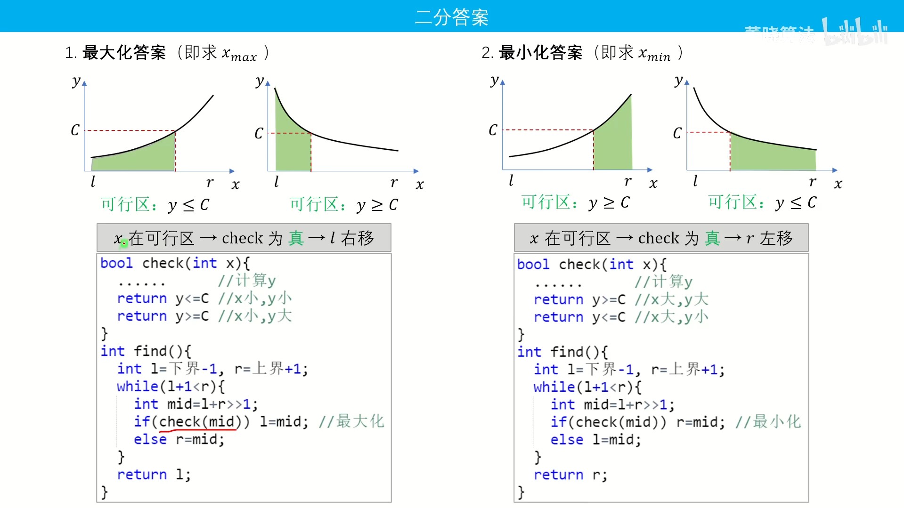

## 二分

### 模板


~~~cpp
//条件：有界，单调。
//应用：“最大值最小”，“最小值最大”

//查找第一个>=q的数的下标
int find1(int q) {
	int l = 0, r = n + 1;//开区间
	while (l + 1 < r) {//l+1=r时结束
		int mid = (l + r)>> 1;
		if (a[mid] >= q) r = mid;
		else l = mid;
	}
	return r;
}

//查找第一个<=q的数的下标
int find2(int q) {
	int l = 0, r = n + 1;
	while (l + 1 < r) {
		int mid = (l + r) >> 1;
		if (a[mid] <= q) l = mid;
		else r = mid;
	}
	return l;
}
~~~


### 习题

[求阶乘](https://www.lanqiao.cn/problems/2145/learning/)

[青蛙过河](https://www.lanqiao.cn/problems/2097/learning/)(难点：合法性的充要条件)

[5562. 最大生产](https://www.acwing.com/problem/content/5565/)

[字串简写](https://www.dotcpp.com/oj/problem3154.html)(二分查找lower_bound or 双指针)

[抓娃娃](https://www.lanqiao.cn/problems/17110/learning/?page=1&first_category_id=1&name=%E6%8A%93%E5%A8%83%E5%A8%83)(前缀和也可做)


## 三分
### 板子题
[曲线](https://blog.csdn.net/weixin_45485187/article/details/103027627)

```c
#include<iostream>
#include<string.h>
#include<string>
#include<vector>
#include<algorithm>
using namespace std;

const int N = 1e5+10;
double a[N], b[N], c[N];
int n;

double func(double x) {
	double res = -1e30;
	for (int i = 0; i < n; ++i) {
		res = max(res, a[i] * x * x + b[i] * x + c[i]);
	}
	return res;
}

void solve() {
	scanf("%d", &n);
	for (int i = 0; i < n; i++) {
		scanf("%lf%lf%lf", &a[i], &b[i], &c[i]);
	}

	double l = 0, r = 1000;
	while (r - l > 1e-10) {
		double d = (r - l) / 3;
		double midl = l + d, midr = r - d;
		if (func(midl) > func(midr))l = midl;
		else r = midr;
	}

	printf("%.4lf\n", func(r));
}
int main()
{
	int T = 1;
	cin >> T;
	while (T--) {
		solve();
	}
	return 0;
}
```


[有序矩阵中第 K 小的元素](https://leetcode.cn/problems/kth-smallest-element-in-a-sorted-matrix/description/)

