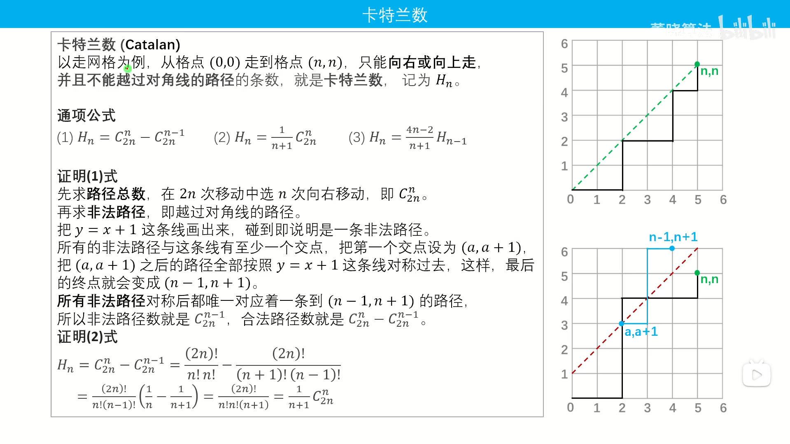
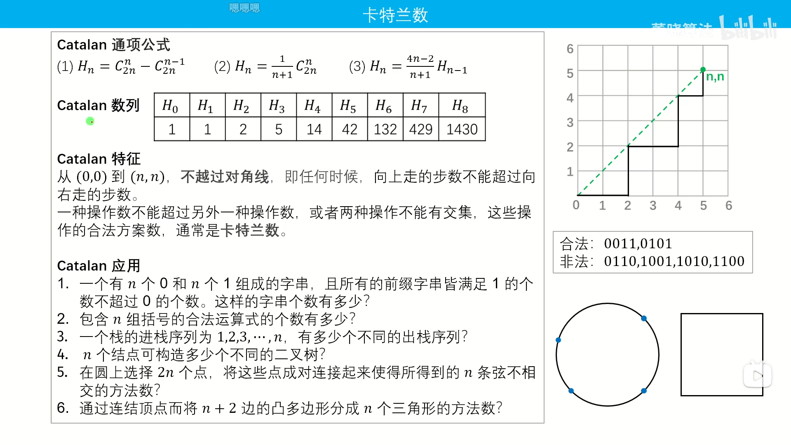
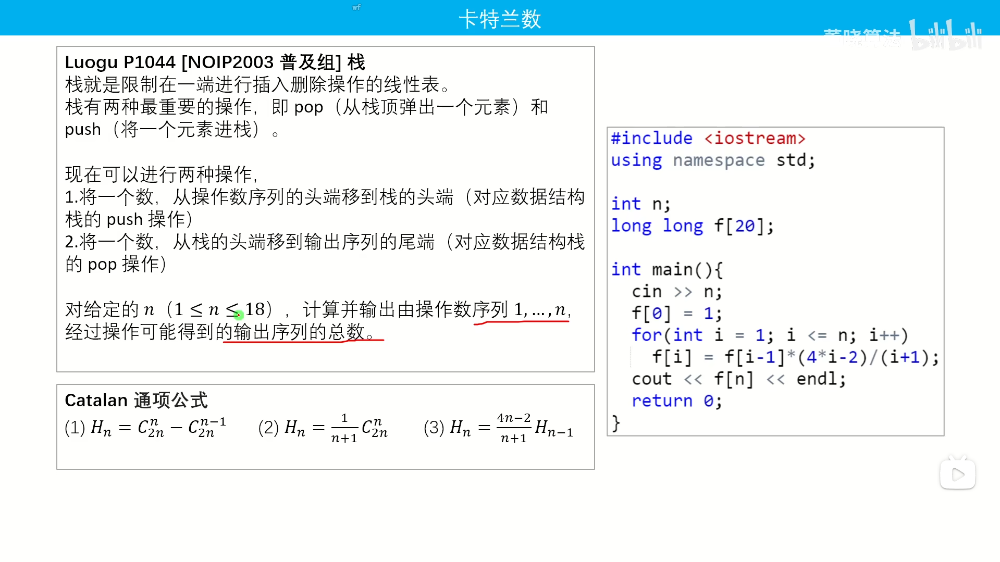

## 各种模运算
```python
MOD = 1_000_000_007

// 加
(a + b) % MOD

// 减
(a - b + MOD) % MOD

// 把任意整数 a 取模到 [0,MOD-1] 中，无论 a 是正是负
(a % MOD + MOD) % MOD

// 乘（注意使用 64 位整数）
a * b % MOD

// 多个数相乘，要步步取模，防止溢出
a * b % MOD * c % MOD

// 除（MOD 是质数且 b 不是 MOD 的倍数）
a * qpow(b, MOD - 2, MOD) % MOD
```


## Catalan卡特兰数








## 线性筛法

思想:每个合数只会被它的**最小质因子**“筛”一次

$O(n)$
```cpp
// 线性筛法板子
const int N = 1000010;
int prim[N];//存素数
int cnt=0;//质数个数
bool vis[N];//记录被划掉的合数

void get_prim(int x){
    for(int i=2;i<=x;i++){
        if(!vis[i])prim[++cnt]=i;
        for(int j=1;prim[j]<=x/i;j++){//越界中断
            vis[i*prim[j]]=true;
            if(i%prim[j]==0) break;//整除中断
        }
    }
}
```

## *FFT
[多项式乘法](https://www.luogu.com.cn/record/176462198)


## 推公式
[60. Permutation Sequence](https://leetcode.cn/problems/permutation-sequence/description/) (DFS也可过)


## 整除性质

[冶炼金属](https://www.dotcpp.com/oj/problem3150.html)(另解：二分)


## 板子题

[蓝桥杯第十届省赛A组 扩展欧几里得算法（求逆元）+快速乘+快速幂](https://blog.csdn.net/Cyril_KI/article/details/107542867?spm=1001.2101.3001.6650.13&utm_medium=distribute.pc_relevant.none-task-blog-2%7Edefault%7ECTRLIST%7ERate-13-107542867-blog-115735262.235%5Ev43%5Epc_blog_bottom_relevance_base1&depth_1-utm_source=distribute.pc_relevant.none-task-blog-2%7Edefault%7ECTRLIST%7ERate-13-107542867-blog-115735262.235%5Ev43%5Epc_blog_bottom_relevance_base1&utm_relevant_index=15)

```cpp
#include<iostream>
#include<string>
#include<cstring>

using namespace std;
typedef long long ll;
#define int long long
#define endl '\n'
int p, q, e, ans;
int n = 1001733993063167141, d = 212353;
int C = 20190324;

// 试除法判定质数
bool prime(int x) {
    if (x < 2) return false;
    for(int i=2;i<=x/i;i++){
        if(x%i==0)return false;
    }
    return true;
}

int gcd(int a, int b) {
	return b ? gcd(b, a%b) : a;
}

int gcd_ex(int a, int b, int& x, int& y) {
	if (b == 0) {
		x = 1; y = 0;
		return a;
	}
	int x1, y1;
	int gcd = gcd_ex(b, a % b, x1, y1);
	x = y1; y = x1 - a / b * y1;
	return gcd;
}

int mod_re(int a, int b) {
	int d, x, y;
	d = gcd_ex(a, b, x, y);
	if (d == 1)return (x % b + b) % b;
	else return -1;
}

int fast_mul(int a, int b, int mod) {
	int ans = 0;
	while (b) {
		if (b & 1) {
			ans = (ans + a) % mod;
		}
		a = (a <<= 1) % mod;
		b >>= 1;
	}
	return ans;
}

int pow_mod(int a, int b, int mod) {
	int res = 1, base = a % mod;
	while (b) {
		if (b & 1) {
			res = fast_mul(res, base, mod);
		}
		base = fast_mul(base, base, mod);
		b >>= 1;
	}
	return res;
}

void solve() {
	//求解p,q 
	//for (ll i = 1000;; i++) {
	//	if (n % i == 0 && prime(i) && prime(n / i) && gcd(d, (i - 1) * (n / i - 1)) == 1) {
	//		p = i;
	//		q = n / i;
	//		break;
	//	}
	//}
	p = 891234941, q = 1123984201;
	int t = (p - 1) * (q - 1);
	e = mod_re(d, t);
	int  x = pow_mod(C, e, n);
	cout << x;
}

signed main() {
	ios::sync_with_stdio(0);
	cin.tie(0); cout.tie(0);

	solve();
	return 0;
}

```
