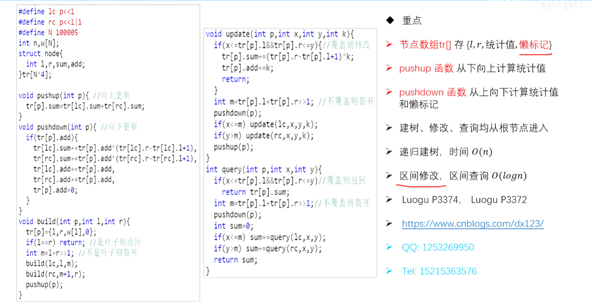

## 树状数组 Binary Index Tree
思想：用**树结构**维护“前缀和”,在$log(n)$的时间内实现**单点修改**和**区间查询**

[讲解](https://www.acwing.com/solution/content/13818/)

[307. Range Sum Query - Mutable](https://leetcode.cn/problems/range-sum-query-mutable/submissions/560504025/)（板子题）

[树状数组+桶排序](https://www.acwing.com/solution/content/253039/)
[树状数组+差分](https://www.acwing.com/solution/content/253054/)

## 线段树 Segment Tree

基于分治思想的二叉树，在$log(n)$的时间内实现**区间修改**和**区间查询**

[AcWing 1275. 最大数](https://www.acwing.com/solution/content/253252/)

[53. Maximum Subarray](https://leetcode.cn/problems/maximum-subarray/description/)(基于分治，更简单的做法是DP)
